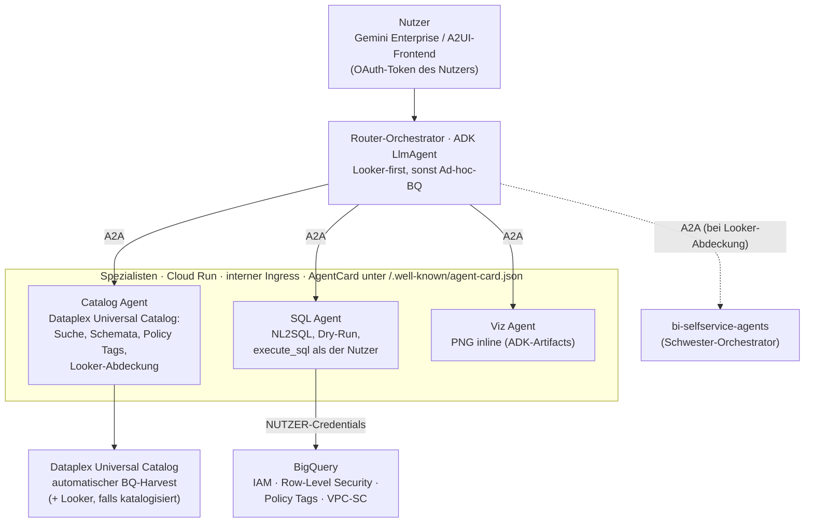
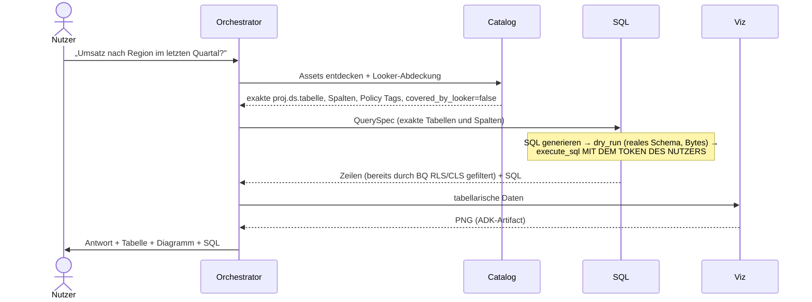

# bq-adhoc-agents

🌐 [Español](README.md) · [English](README.en.md) · [Français](README.fr.md) · **Deutsch** · [Português](README.pt.md)

Ein Multi-Agenten-System, das [bi-selfservice-agents](https://github.com/joseimj/bi-selfservice-agents) ergänzt und Analytics-Self-Service über den **Long Tail der BigQuery-Daten bereitstellt, die nicht in Looker onboarded sind**. Ausgehend von einer Anfrage in natürlicher Sprache entdecken die Agenten die relevanten Assets im **Dataplex Universal Catalog** (GCPs Wissenskatalog, der BigQuery automatisch harvestet), generieren gegen das reale Schema validiertes SQL, führen es **mit der Identität des Endnutzers** aus — sodass BigQuery seine eigene Zugriffskontrolle durchsetzt — und beantworten Geschäftsfragen mit Tabellen und Diagrammen inline. Aufgebaut auf ADK, interner A2A-Kommunikation, zwei Oberflächen (Gemini Enterprise und A2UI-Frontend), Terraform-Deployment.

## 1. Kontext: warum zwei Systeme statt einem

`bi-selfservice-agents` löst Self-Service über **governte** Daten: Die semantische LookML-Schicht ist die einzige Quelle der Metriken, der Builder materialisiert native Dashboards, und die Berechtigungsobergrenze ist das Permission Set des Looker-Service-Users. Dieses Design ist für seinen Geltungsbereich korrekt — lässt aber zwei Realitäten jeder Organisation außen vor:

1. **Nicht modellierte Daten.** Die meisten BigQuery-Tabellen erreichen LookML nie: Staging, neue Domänen, Datasets von Teams ohne dediziertes BI, Ergebnisse explorativer Pipelines. Heute ist SQL-Kenntnis der einzige Weg, sie zu befragen.
2. **Heterogene Berechtigungen.** In Looker vermittelt das Modell den Zugriff; in rohem BigQuery definieren IAM, Row-Level Security, Policy Tags (Spaltenmaskierung) und VPC-SC den Zugriff — **pro Nutzer**. Ein breit berechtigter Service Account würde dieses Modell brechen.

Dieses System deckt genau diese Lücke ab und behandelt Looker als **bevorzugten Kern, nicht als Regel**: Zeigt der Katalog, dass die Daten in Looker modelliert sind, schlägt der Orchestrator die Delegation an das Schwestersystem vor (governte Metrik > Ad-hoc-SQL); wenn nicht — oder der Nutzer ohne modernes Looker arbeitet — greift die Ad-hoc-BQ-Route.

| | bi-selfservice-agents | bq-adhoc-agents (dieses Repo) |
|---|---|---|
| Semantische Quelle der Wahrheit | LookML | Dataplex Universal Catalog |
| Ausführungsidentität | Looker-Service-User | **Endnutzer (OAuth)** |
| Zugriffskontrolle | Looker Permission Set / Model Set | BQ IAM + RLS + Policy Tags, durchgesetzt von BQ |
| Ergebnis | Persistentes, governtes Dashboard | Antwort + Tabelle + flüchtiges Diagramm |
| Schreibzugriff | Ja (Dashboards in begrenztem Ordner) | **Nein** (`WriteMode.BLOCKED`) |
| Anti-Halluzinations-Barriere | Catalog Agent vs. LookML + preview_query | Catalog Agent vs. Dataplex + **Dry-Run** |

## 2. Architektur



### Verantwortlichkeiten

| Agent | Runtime | Verantwortung | Haupt-Tools |
|---|---|---|---|
| **Orchestrator** | Agent Engine (+ optional Cloud Run A2A/A2UI) | Interpretiert die Anfrage, routet Looker-first vs. Ad-hoc-BQ, verhandelt die `QuerySpec`, synthetisiert die Antwort | `RemoteA2aAgent`-Subagenten |
| **Catalog** | Cloud Run (interner Ingress) | Nur-Lese-Autorität über Dataplex: entdeckt Assets nach Geschäftsbegriffen, löst exakte Schemata und Policy Tags auf, ermittelt Looker-Abdeckung | `search_catalog`, `get_entry_details`, `check_looker_coverage` |
| **SQL** | Cloud Run (interner Ingress) | Einziger Datenabfragepfad: NL2SQL, Dry-Run-Validierung, Ausführung mit Nutzer-Credentials | `dry_run_sql`, ADK-`BigQueryToolset` (`get_table_info`, `execute_sql`, optional `ask_data_insights`) |
| **Viz** | Cloud Run (interner Ingress) | Diagramme aus bereits autorisierten Ergebnissen; PNG als ADK-Artifacts | `render_chart` (matplotlib) |

### Lebenszyklus einer Anfrage



## 3. Zugriffskontrolle: die zentrale Designentscheidung

**Der Agent entscheidet nie, was der Nutzer sehen darf; das entscheidet BigQuery.** Jede Query läuft mit den Credentials des Endnutzers. Das First-Party-`BigQueryToolset` von ADK unterstützt das ab Werk über `BigQueryCredentialsConfig`:

- **Gemini Enterprise** verwaltet das OAuth-Token des Nutzers und ADK liest es über `external_access_token_key` aus dem Session State (durch Registrierung einer *Authorization* in GE mit dem Scope `bigquery.readonly`). Das ist der Standardmodus (`EUC_MODE=gemini_enterprise`).
- **Eigenes Frontend (A2UI)**: interaktiver OAuth-2.0-Flow mit `client_id`/`client_secret` — ADK löst den Login aus und persistiert das Token in der Session (`EUC_MODE=oauth_interactive`).
- **ADC** nur für lokale Entwicklung.

Konsequenzen, die man *gratis* erhält, ohne Logik in den Agenten:

- **IAM**: Der Nutzer kann nur Datasets/Tabellen abfragen, für die er `bigquery.dataViewer` hält (oder autorisierte Views).
- **Row-Level Security**: Row Access Policies filtern Zeilen nach Identität — zwei Nutzer mit derselben Frage erhalten unterschiedliche, korrekte Antworten.
- **Policy Tags / Spaltenmaskierung**: Sensible Spalten kommen je nach Taxonomy Grants des Nutzers maskiert oder verweigert an; der Catalog Agent antizipiert sie (liest sie aus den Metadaten), damit der Orchestrator es erklären kann.
- **Zuordenbares Auditing**: Jeder BQ-Job wird in Cloud Audit Logs auf den Namen des Nutzers protokolliert, mit `job_labels` (`origin=bq-adhoc-agents`) zum Filtern in `INFORMATION_SCHEMA.JOBS`.

Der Service Account der Agenten ist auf Plattform-Berechtigungen reduziert (Logging, Artifacts, `dataplex.catalogViewer` für den Metadaten-Harvest) — **er hat keinen Zugriff auf Geschäftsdaten**. Zusätzliche Guardrails per Konstruktion: `WriteMode.BLOCKED` (das System kann keine Daten mutieren), `maximum_bytes_billed` pro Query, Zeilenlimit Richtung LLM-Kontext und eine optionale Dataset-Allowlist (`BQ_DATASET_ALLOWLIST`) als Defense in Depth.

**Verhaltensregel**: Ein `403` oder ein durch RLS gefiltertes Ergebnis ist das funktionierende System. Der Prompt des SQL Agents verbietet explizit, Queries umzuformulieren, um eine Verweigerung zu umgehen; die korrekte Antwort ist zu erklären und an den Data Owner zu verweisen.

## 4. Dataplex Universal Catalog als De-facto-Semantikschicht

In Abwesenheit von LookML übernimmt der Katalog die Rolle der Anti-Halluzinations-Barriere:

- **Automatischer Harvest**: Jede BQ-Tabelle/-View erscheint ohne manuelles Onboarding im Katalog, mit Schema, Beschreibungen und Policy Tags.
- **Suche nach Geschäftsbegriffen**: `search_catalog` übersetzt „Umsatz", „Churn", „Inventar" in konkrete Assets; Business-Glossar und Aspekte verbessern das Ranking.
- **Exakte-Namen-Vertrag**: Der SQL Agent akzeptiert nur `project.dataset.table` und Spalten, die der Catalog Agent aufgelöst hat — das Modell „erinnert" sich nie an das Schema, es schlägt nach. Der **Dry-Run** ist die zweite Barriere: Er validiert Syntax, reales Schema und geschätzte Kosten vor der Ausführung.
- **Looker-first-Routing**: Hat die Organisation ihre Looker-Instanz in Dataplex katalogisiert, erkennt `check_looker_coverage`, ob ein Asset bereits modelliert ist (`looker:`-Einträge), und der Orchestrator schlägt die governte Route des Schwester-Repos via A2A vor (`LOOKER_ORCHESTRATOR_URL`). Ist die Abdeckung `unknown` oder hat der Nutzer kein Looker (z. B. Looker Original ohne Self-Service-Oberfläche), geht es über die BQ-Route weiter. Looker ist Präferenz, keine Voraussetzung.

## 5. Konfiguration

| Variable | Geltungsbereich | Beschreibung |
|---|---|---|
| `AGENT_MODEL_PROVIDER` | alle | `gemini` \| `claude` \| `claude_native` \| `anthropic` (Override pro Agent: `SQL_MODEL_PROVIDER` usw.) |
| `GOOGLE_CLOUD_PROJECT_ID` | alle | GCP-Projekt |
| `EUC_MODE` | sql | `gemini_enterprise` \| `oauth_interactive` \| `adc` |
| `GE_AUTH_ID` | sql | Schlüssel des Nutzer-Tokens im Session State (GE-Authorization) |
| `OAUTH_CLIENT_ID` / `OAUTH_CLIENT_SECRET` | sql | Nur im Modus `oauth_interactive` |
| `BQ_BILLING_PROJECT` | sql | Compute-/Abrechnungsprojekt der Queries |
| `BQ_MAX_BYTES_BILLED` | sql | Obergrenze pro Query (Standard 10 GiB) |
| `BQ_MAX_RESULT_ROWS` | sql | Maximale Zeilen Richtung LLM (Standard 200) |
| `BQ_DATASET_ALLOWLIST` | catalog | Optionale Dataset-Allowlist (Defense in Depth) |
| `DATAPLEX_LOCATION` | catalog | Katalog-Location (Standard `global`) |
| `CATALOG/SQL/VIZ_AGENT_URL` | Orchestrator | A2A-Endpoints der Spezialisten |
| `LOOKER_ORCHESTRATOR_URL` | Orchestrator | Optional: Orchestrator von bi-selfservice-agents für die governte Route |
| `PUBLIC_URL` | Spezialisten | Von der AgentCard angekündigte URL (Cloud Run) |

## 6. Voraussetzungen

- GCP-Projekt mit Billing; APIs: BigQuery, Dataplex, Vertex AI, Cloud Run, Secret Manager.
- **OAuth**: Consent Screen + Client ID; in Gemini Enterprise eine *Authorization* mit dem Scope `https://www.googleapis.com/auth/bigquery.readonly` registrieren und deren Id als `GE_AUTH_ID` verwenden.
- Agenten-SA mit: `logging.logWriter`, `dataplex.catalogViewer`, `aiplatform.user`. **Keine BQ-Datenrollen.**
- Endnutzer mit ihren normalen BQ-Berechtigungen (IAM/RLS/Policy Tags bereits von den Data Owners konfiguriert: das System fügt nichts hinzu und entfernt nichts).
- Optional: in Dataplex katalogisierte Looker-Instanz (für Looker-first-Routing) und deployte `bi-selfservice-agents` (für A2A-Delegation).

## 7. Deployment

Das Muster ist identisch zum Schwester-Repo und das Terraform fast 1:1 wiederverwendbar: Artifact Registry + Cloud Build pro Agent (gemeinsamer Kontext mit `common/`), drei Cloud-Run-Dienste mit internem Ingress und IAM-authentifizierter Invocation (`roles/run.invoker` für die Orchestrator-SA), Orchestrator auf Agent Engine mit Registrierung in Gemini Enterprise. Was sich ändert: die Umgebungsvariablen (§5), die SA ohne Datenrollen und die GE-Authorization für das Nutzer-Token.

```bash
cd terraform
cp terraform.tfvars.example terraform.tfvars
terraform init && terraform apply
```

Lokale Entwicklung:

```bash
pip install -r agents/requirements.txt
export EUC_MODE=adc GOOGLE_CLOUD_PROJECT_ID=mein-projekt
adk web agents/
```

## 8. Beispielablauf

> „Wie hoch war der durchschnittliche Bon pro Region im Juni? Zeig es als Balkendiagramm."

1. **Catalog** findet `analytics.orders_raw` in Dataplex (nicht von Looker abgedeckt), liefert die exakten Spalten (`region`, `order_total`, `created_at`) und markiert `customer_email` als policy-tagged.
2. Der Orchestrator bestätigt die `QuerySpec` und delegiert an den **SQL Agent**, der das SQL generiert, per Dry-Run validiert (0,4 GiB, im Budget) und **mit dem Token des Nutzers** ausführt. Hat der Nutzer eine Row Access Policy, die ihn auf die Region Nord beschränkt, enthält die Antwort nur die Region Nord — ohne dass irgendein Agent das entschieden hätte.
3. **Viz** rendert das Balken-PNG als Artifact; der Orchestrator antwortet mit der Zahl, dem Diagramm und dem verwendeten SQL.
4. Hätte dieselbe Frage zu einem Looker-Explore aufgelöst, hätte der Orchestrator angeboten: „Diese Daten sind bereits in Looker governt; möchtest du ein persistentes Dashboard?" → A2A-Delegation an das Schwestersystem.

## 9. Qualitätsregeln: vorschlagen (LLM) / genehmigen (Steward) / anwenden (CI)

Agenten können Qualitätsregeln in den Katalog tragen (Dataplex AutoDQ), aber mit strikter Gewaltenteilung — kein LLM schreibt Governance:

1. **Vorschlagen (Catalog Agent).** `profile_table_for_rules` profiliert die Tabelle und der Agent leitet Kandidatenregeln ab (non_null, uniqueness, set, range, regex, row_condition, sql_assertion), präsentiert in Geschäftssprache. Nach Bestätigung des Nutzers serialisiert `submit_quality_proposal` den Vorschlag als YAML (`rules/{project}/{dataset}/{table}.yaml`) und öffnet einen **PR/MR im Governance-Repo** (`dq-rules-repo/`). Der Git-Provider ist Konfiguration: `GIT_PROVIDER=github|gitlab|bitbucket` mit Adaptern in `common/git_provider.py` (gleiche Schnittstelle: Branch → Commit → PR), sodass verschiedene Domänen auf verschiedenen Plattformen governt werden können.
2. **Genehmigen (menschlicher Data Steward).** Review dort, wo sie ohnehin alles reviewen: Git — Diff, Kommentare, CODEOWNERS pro Domäne, geschützter `main`-Branch. Die Pipeline validiert den Vorschlag im PR (`apply.py validate`). Die Identität des Genehmigers garantiert die Git-Plattform, nicht der Chat.
3. **Anwenden (deterministisches CI).** Der Merge löst `apply.py apply` aus, das den DataScan erstellt/aktualisiert und den ersten Lauf startet. Die **einzige** Identität mit `roles/dataplex.dataScanEditor` ist die Governance-SA des CI (via Workload Identity Federation, ohne Schlüssel). Weder Nutzer noch Agenten brauchen Schreibrechte auf Dataplex: Das LLM ist strukturell unfähig, Governance zu schreiben.

Alle drei CIs (GitHub Actions, GitLab CI, Bitbucket Pipelines) rufen dasselbe `apply.py` auf. Die von den Scans veröffentlichten Scores werden zu Katalog-Aspekten, die der Catalog Agent bereits liest — der Orchestrator kann beim Antworten auf die Zuverlässigkeit einer Tabelle hinweisen. Rollback = Revert des PR.

**Wie die Stewards davon erfahren.** Drei Ebenen: (a) automatische Zuweisung pro Domäne — `CODEOWNERS` auf GitHub/GitLab (Bitbucket: Default Reviewers) weist den richtigen Steward zu und Branch Protection erzwingt seine Genehmigung, mit der nativen Benachrichtigung der Plattform; (b) einheitliche Chat-Benachrichtigung — der `validate`-Schritt postet an den Webhook des Steward-Spaces (`CHAT_WEBHOOK_URL`), derselbe Mechanismus in allen drei CIs; (c) optional ein geplanter Reminder (Cloud Scheduler), der PRs auflistet, die >N Tage offen sind.

**In den Review injizierte Dataplex-Metadaten.** `governance_report.py` läuft im `validate` jedes PR mit der Leser-SA und postet als Kommentar (via dem plattformübergreifenden `post_comment.py`) einen LIVE-Bericht aus dem Katalog: Entry-Beschreibung, Spalte-für-Spalte-Verifikation gegen das aktuelle Schema (fehlende Spalte = blockierte Pipeline), Policy Tags auf den Spalten der Regeln, aktueller Qualitätsscore falls bereits ein Scan existiert, und Tabellenvolumen als Kostenproxy. Der Steward genehmigt mit frischem Kontext, nicht mit dem, was der Agent beim Vorschlagen sah. Post-Merge fließen die Scan-Ergebnisse als Aspekte in den Katalog zurück, die der Catalog Agent liest — geschlossener Kreislauf.

Variablen: `GIT_PROVIDER`, `GIT_REPO`, `GIT_BASE_BRANCH`, `GIT_TOKEN` (Secret Manager), `GIT_API_BASE` (self-hosted), `DATAPLEX_DQ_LOCATION` (DataScans sind regional), `CHAT_WEBHOOK_URL` (CI-Secret).

**Identitäten (Terraform enthalten):** `bq-adhoc-agents` (Runtime, ohne Daten) · `dq-rules-reader` (validate: catalogViewer, dataScanViewer, bq metadataViewer) · `dq-rules-governance` (apply: dataScanEditor, die einzige mit Schreibzugriff). Ein Workload-Identity-Federation-Pool mit drei Providern (GitHub/GitLab/Bitbucket) erlaubt den CIs, diese SAs ohne Schlüssel anzunehmen, mit **doppeltem Schloss in IAM**: Die Leser-SA ist von jedem Event des Governance-Repos aus annehmbar, die Governance-SA jedoch nur vom Merge-Event auf den geschützten Branch — auf GitHub über das Attribut `repository@ref` (`...@refs/heads/main`; PRs tragen `refs/pull/N/merge` und matchen nie), auf GitLab über `project_path@ref` (MR-Pipelines tragen den Ref des Quell-Branches), und auf Bitbucket — dessen OIDC-Token keinen Branch enthält — über die `deploymentEnvironmentUuid` eines auf `main` beschränkten Deployment Environments in der Repo-Konfiguration (der `apply`-Schritt deklariert `deployment: production`). Selbst wenn jemand eine Pipeline auf einem Branch manipulierte, scheitert der Token-Austausch Richtung Schreib-SA also in IAM, nicht nur an der Repo-Policy. Branch Protection + CODEOWNERS bleiben notwendig: Sie garantieren, dass das Erreichen von `main` die Genehmigung des Stewards erforderte.

## 10. Geplante Weiterentwicklung

- **Onboarding Agent**: Wiederholt sich eine Ad-hoc-Frage, das Onboarding des Assets nach LookML als Pull Request vorschlagen — dasselbe Vorschlagen/Genehmigen/Anwenden-Muster wie in §9, unter Wiederverwendung von `git_provider.py`; der im Schwester-Repo geplante `LookML Author Agent` ist der natürliche Empfänger.
- **`ask_data_insights`**: NL2SQL an die Conversational Analytics API delegieren (gleiches ADK-Toolset, gleiche Nutzer-Credentials), sobald sie in der Organisation aktiviert ist.
- **Semantic Caching** häufiger QuerySpecs und **kontinuierliche Evaluation** mit einer Batterie von Referenzfragen gegen Staging.

## Autor

**Jose Maldonado** ([@joseimj](https://github.com/joseimj)) — auch Autor von [bi-selfservice-agents](https://github.com/joseimj/bi-selfservice-agents), dem Schwestersystem, das dieses Repo ergänzt.
