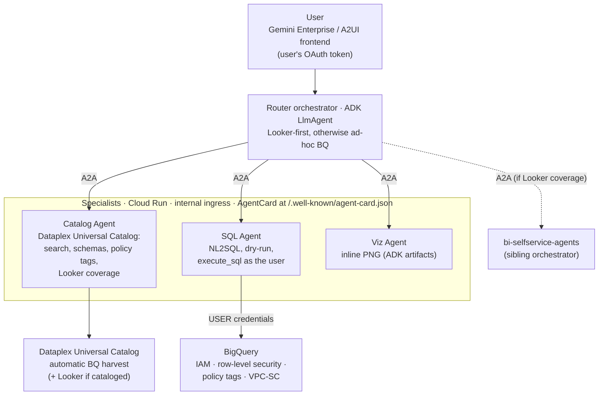
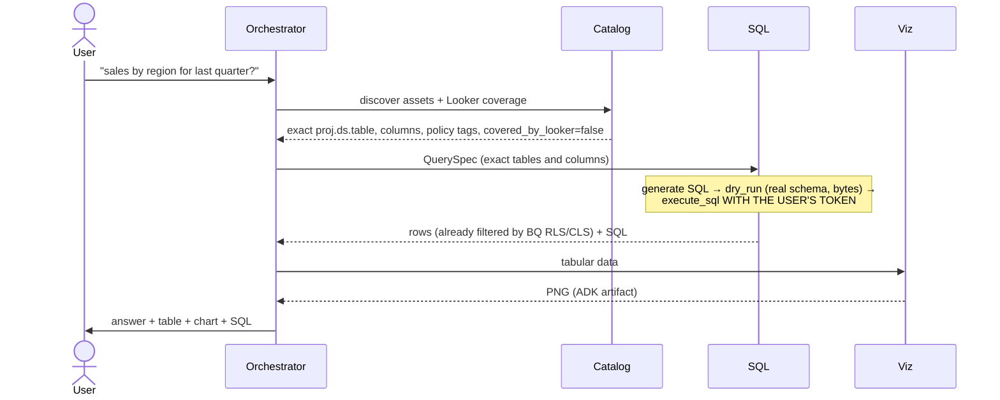

# bq-adhoc-agents

🌐 [Español](README.md) · **English** · [Français](README.fr.md) · [Deutsch](README.de.md) · [Português](README.pt.md)

A multi-agent system that complements [bi-selfservice-agents](https://github.com/joseimj/bi-selfservice-agents), providing analytics self-service over the **long tail of BigQuery data that is not onboarded into Looker**. From a natural-language request, the agents discover the relevant assets in **Dataplex Universal Catalog** (GCP's knowledge catalog, which harvests BigQuery automatically), generate SQL validated against the real schema, execute it **with the end user's identity** — so that BigQuery enforces its own access control — and answer business questions with inline tables and charts. Built on ADK, internal A2A communication, two surfaces (Gemini Enterprise and an A2UI frontend), Terraform deployment.

## 1. Context: why two systems instead of one

`bi-selfservice-agents` solves self-service over **governed** data: the LookML semantic layer is the single source of metrics, the Builder materializes native dashboards, and the permission ceiling is the Looker service user's permission set. That design is correct for its scope — but it leaves out two realities of any organization:

1. **Unmodeled data.** Most BigQuery tables never make it into LookML: staging, new domains, datasets from teams without dedicated BI, outputs of exploratory pipelines. Today, the only way to ask them anything is knowing SQL.
2. **Heterogeneous permissions.** In Looker, access is mediated by the model; in raw BigQuery, access is defined by IAM, row-level security, policy tags (column masking) and VPC-SC — **per user**. A broadly privileged service account would break that model.

This system covers exactly that gap, and treats Looker as **preferred core, not a rule**: if the catalog indicates the data is modeled in Looker, the orchestrator proposes delegating to the sibling system (governed metric > ad-hoc SQL); if it isn't — or the user operates without modern Looker — the ad-hoc BQ route kicks in.

| | bi-selfservice-agents | bq-adhoc-agents (this repo) |
|---|---|---|
| Semantic source of truth | LookML | Dataplex Universal Catalog |
| Execution identity | Looker service user | **End user (OAuth)** |
| Access control | Looker permission set / model set | BQ IAM + RLS + policy tags, enforced by BQ |
| Output | Persistent, governed dashboard | Answer + table + ephemeral chart |
| Writes | Yes (dashboards in a scoped folder) | **No** (`WriteMode.BLOCKED`) |
| Anti-hallucination barrier | Catalog Agent vs LookML + preview_query | Catalog Agent vs Dataplex + **dry-run** |

## 2. Architecture



### Responsibilities

| Agent | Runtime | Responsibility | Main tools |
|---|---|---|---|
| **Orchestrator** | Agent Engine (+ optional Cloud Run A2A/A2UI) | Interprets the request, routes Looker-first vs ad-hoc BQ, negotiates the `QuerySpec`, synthesizes the answer | `RemoteA2aAgent` sub-agents |
| **Catalog** | Cloud Run (internal ingress) | Read-only authority over Dataplex: discovers assets by business terms, resolves exact schemas and policy tags, determines Looker coverage | `search_catalog`, `get_entry_details`, `check_looker_coverage` |
| **SQL** | Cloud Run (internal ingress) | The only data-query path: NL2SQL, dry-run validation, execution with user credentials | `dry_run_sql`, ADK `BigQueryToolset` (`get_table_info`, `execute_sql`, optional `ask_data_insights`) |
| **Viz** | Cloud Run (internal ingress) | Charts from already-authorized results; PNG as ADK artifacts | `render_chart` (matplotlib) |

### Lifecycle of a request



## 3. Access control: the central design decision

**The agent never decides what the user can see; BigQuery does.** Every query runs with the end user's credentials. ADK's first-party `BigQueryToolset` supports this out of the box via `BigQueryCredentialsConfig`:

- **Gemini Enterprise** manages the user's OAuth token and ADK reads it from session state via `external_access_token_key` (registering an *Authorization* in GE with the `bigquery.readonly` scope). This is the default mode (`EUC_MODE=gemini_enterprise`).
- **Own frontend (A2UI)**: interactive OAuth 2.0 flow with `client_id`/`client_secret` — ADK triggers the login and persists the token in session (`EUC_MODE=oauth_interactive`).
- **ADC** only for local development.

Consequences you get *for free*, with no logic in the agents:

- **IAM**: the user can only query datasets/tables where they hold `bigquery.dataViewer` (or authorized views).
- **Row-level security**: row access policies filter rows by identity — two users asking the same question get different answers, correctly.
- **Policy tags / column masking**: sensitive columns arrive masked or denied depending on the user's taxonomy grants; the Catalog Agent anticipates them (reads them from metadata) so the orchestrator can explain it.
- **Attributable auditing**: every BQ job is logged under the user's name in Cloud Audit Logs, with `job_labels` (`origin=bq-adhoc-agents`) for filtering in `INFORMATION_SCHEMA.JOBS`.

The agents' service account is reduced to platform permissions (logging, artifacts, `dataplex.catalogViewer` for the metadata harvest) — **it has no access to business data**. Additional guardrails by construction: `WriteMode.BLOCKED` (the system is incapable of mutating data), `maximum_bytes_billed` per query, a cap on rows sent to the LLM context, and an optional dataset allowlist (`BQ_DATASET_ALLOWLIST`) as defense in depth.

**Behavioral rule**: a `403` or an RLS-filtered result is the system working. The SQL Agent's prompt explicitly forbids reformulating queries to circumvent a denial; the correct response is to explain and point to the data owner.

## 4. Dataplex Universal Catalog as the de facto semantic layer

In the absence of LookML, the catalog plays the anti-hallucination-barrier role:

- **Automatic harvest**: every BQ table/view appears in the catalog without manual onboarding, with schema, descriptions and policy tags.
- **Search by business terms**: `search_catalog` translates "sales", "churn", "inventory" into concrete assets; the business glossary and aspects enrich the ranking.
- **Exact-name contract**: the SQL Agent only accepts `project.dataset.table` and columns resolved by the Catalog Agent — the model never "remembers" the schema, it looks it up. The **dry-run** is the second barrier: it validates syntax, real schema and estimated cost before executing.
- **Looker-first routing**: if the organization cataloged its Looker instance in Dataplex, `check_looker_coverage` detects whether an asset is already modeled (`looker:` entries) and the orchestrator proposes the sibling repo's governed route via A2A (`LOOKER_ORCHESTRATOR_URL`). If coverage is `unknown` or the user has no Looker (e.g. Looker Original without a self-service surface), the BQ route continues. Looker is a preference, not a requirement.

## 5. Configuration

| Variable | Scope | Description |
|---|---|---|
| `AGENT_MODEL_PROVIDER` | all | `gemini` \| `claude` \| `claude_native` \| `anthropic` (per-agent override: `SQL_MODEL_PROVIDER`, etc.) |
| `GOOGLE_CLOUD_PROJECT_ID` | all | GCP project |
| `EUC_MODE` | sql | `gemini_enterprise` \| `oauth_interactive` \| `adc` |
| `GE_AUTH_ID` | sql | Key of the user token in session state (GE Authorization) |
| `OAUTH_CLIENT_ID` / `OAUTH_CLIENT_SECRET` | sql | Only `oauth_interactive` mode |
| `BQ_BILLING_PROJECT` | sql | Compute/billing project for queries |
| `BQ_MAX_BYTES_BILLED` | sql | Per-query ceiling (default 10 GiB) |
| `BQ_MAX_RESULT_ROWS` | sql | Max rows sent to the LLM (default 200) |
| `BQ_DATASET_ALLOWLIST` | catalog | Optional dataset allowlist (defense in depth) |
| `DATAPLEX_LOCATION` | catalog | Catalog location (default `global`) |
| `CATALOG/SQL/VIZ_AGENT_URL` | orchestrator | A2A endpoints of the specialists |
| `LOOKER_ORCHESTRATOR_URL` | orchestrator | Optional: bi-selfservice-agents orchestrator for the governed route |
| `PUBLIC_URL` | specialists | URL announced by the AgentCard (Cloud Run) |

## 6. Prerequisites

- GCP project with billing; APIs: BigQuery, Dataplex, Vertex AI, Cloud Run, Secret Manager.
- **OAuth**: consent screen + client ID; in Gemini Enterprise, register an *Authorization* with scope `https://www.googleapis.com/auth/bigquery.readonly` and use its id as `GE_AUTH_ID`.
- Agents SA with: `logging.logWriter`, `dataplex.catalogViewer`, `aiplatform.user`. **No BQ data roles.**
- End users with their normal BQ permissions (IAM/RLS/policy tags already configured by data owners: the system adds or removes nothing).
- Optional: Looker instance cataloged in Dataplex (for Looker-first routing) and `bi-selfservice-agents` deployed (for A2A delegation).

## 7. Deployment

The pattern is identical to the sibling repo and the Terraform is reusable almost 1:1: Artifact Registry + Cloud Build per agent (shared context with `common/`), three Cloud Run services with internal ingress and IAM-authenticated invocation (`roles/run.invoker` for the orchestrator SA), orchestrator on Agent Engine registered in Gemini Enterprise. What changes: the environment variables (§5), the SA without data roles, and the GE Authorization for the user token.

```bash
cd terraform
cp terraform.tfvars.example terraform.tfvars
terraform init && terraform apply
```

Local development:

```bash
pip install -r agents/requirements.txt
export EUC_MODE=adc GOOGLE_CLOUD_PROJECT_ID=my-project
adk web agents/
```

## 8. Example flow

> "What was the average ticket by region in June? Show it as a bar chart."

1. **Catalog** finds `analytics.orders_raw` in Dataplex (not covered by Looker), returns exact columns (`region`, `order_total`, `created_at`) and flags `customer_email` as policy-tagged.
2. The orchestrator confirms the `QuerySpec` and delegates to the **SQL Agent**, which generates the SQL, validates it with a dry-run (0.4 GiB, within budget) and executes it **with the user's token**. If the user has a row access policy limiting them to the North region, the answer only contains the North region — with no agent having decided it.
3. **Viz** renders the bar PNG as an artifact; the orchestrator answers with the figure, the chart and the SQL used.
4. If the same question had resolved to a Looker explore, the orchestrator would have offered: "This data is already governed in Looker; do you want a persistent dashboard?" → A2A delegation to the sibling system.

## 9. Quality rules: propose (LLM) / approve (steward) / apply (CI)

Agents can push quality rules toward the catalog (Dataplex AutoDQ), but with strict separation of powers — no LLM writes governance:

1. **Propose (Catalog Agent).** `profile_table_for_rules` profiles the table and the agent derives candidate rules (non_null, uniqueness, set, range, regex, row_condition, sql_assertion) presented in business language. Upon the user's confirmation, `submit_quality_proposal` serializes the proposal as YAML (`rules/{project}/{dataset}/{table}.yaml`) and opens a **PR/MR in the governance repo** (`dq-rules-repo/`). The Git provider is configuration: `GIT_PROVIDER=github|gitlab|bitbucket` with adapters in `common/git_provider.py` (same interface: branch → commit → PR), so different domains can be governed on different platforms.
2. **Approve (human data steward).** Review where they already review everything: Git — diff, comments, per-domain CODEOWNERS, protected `main` branch. The pipeline validates the proposal on the PR (`apply.py validate`). The approver's identity is guaranteed by the Git platform, not the chat.
3. **Apply (deterministic CI).** The merge triggers `apply.py apply`, which creates/updates the DataScan and launches the first run. The **only** identity with `roles/dataplex.dataScanEditor` is the CI's governance SA (via Workload Identity Federation, no keys). Neither users nor agents need write permissions on Dataplex: the LLM is structurally incapable of writing governance.

All three CIs (GitHub Actions, GitLab CI, Bitbucket Pipelines) invoke the same `apply.py`. Scores published by the scans become catalog aspects the Catalog Agent already reads — the orchestrator can flag a table's reliability when answering. Rollback = revert the PR.

**How stewards find out.** Three layers: (a) automatic assignment by domain — `CODEOWNERS` on GitHub/GitLab (Bitbucket: default reviewers) assigns the right steward and branch protection requires their approval, with the platform's native notification; (b) uniform chat notification — the `validate` step posts to the stewards' space webhook (`CHAT_WEBHOOK_URL`), same mechanism across all three CIs; (c) optionally, a scheduled reminder (Cloud Scheduler) listing PRs open >N days.

**Dataplex metadata injected into the review.** `governance_report.py` runs in each PR's `validate` step with the reader SA and posts as a comment (via the multi-platform `post_comment.py`) a LIVE report from the catalog: entry description, column-by-column verification against the current schema (missing column = blocked pipeline), policy tags on the rules' columns, the current quality score if a scan already exists, and table volume as a cost proxy. The steward approves with fresh context, not with what the agent saw when proposing. Post-merge, scan results flow back to the catalog as aspects the Catalog Agent reads — a closed loop.

Variables: `GIT_PROVIDER`, `GIT_REPO`, `GIT_BASE_BRANCH`, `GIT_TOKEN` (Secret Manager), `GIT_API_BASE` (self-hosted), `DATAPLEX_DQ_LOCATION` (DataScans are regional), `CHAT_WEBHOOK_URL` (CI secret).

**Identities (Terraform included):** `bq-adhoc-agents` (runtime, no data) · `dq-rules-reader` (validate: catalogViewer, dataScanViewer, bq metadataViewer) · `dq-rules-governance` (apply: dataScanEditor, the only one with write). A Workload Identity Federation pool with three providers (GitHub/GitLab/Bitbucket) lets the CIs assume those SAs without keys, with a **double lock in IAM**: the reader SA can be assumed from any event of the governance repo, but the governance SA only from the merge event to the protected branch — on GitHub via the `repository@ref` attribute (`...@refs/heads/main`; PRs carry `refs/pull/N/merge` and never match), on GitLab via `project_path@ref` (MR pipelines carry the source-branch ref), and on Bitbucket — whose OIDC token includes no branch — via the `deploymentEnvironmentUuid` of a deployment environment restricted to `main` in the repo configuration (the `apply` step declares `deployment: production`). Thus, even if someone tampered with a pipeline on a branch, the token exchange toward the write SA fails at IAM, not merely at repo policy. Branch protection + CODEOWNERS remain necessary: they are what guarantees that reaching `main` required the steward's approval.

## 10. Planned evolution

- **Onboarding Agent**: when an ad-hoc question recurs, propose onboarding the asset into LookML as a pull request — same propose/approve/apply pattern as §9, reusing `git_provider.py`; the `LookML Author Agent` planned in the sibling repo is the natural receiver.
- **`ask_data_insights`**: delegate NL2SQL to the Conversational Analytics API (same ADK toolset, same user credentials) once enabled in the organization.
- **Semantic caching** of frequent QuerySpecs and **continuous evaluation** with a battery of reference questions against staging.

## Author

**Jose Maldonado** ([@joseimj](https://github.com/joseimj)) — also the author of [bi-selfservice-agents](https://github.com/joseimj/bi-selfservice-agents), the sibling system this repo complements.
