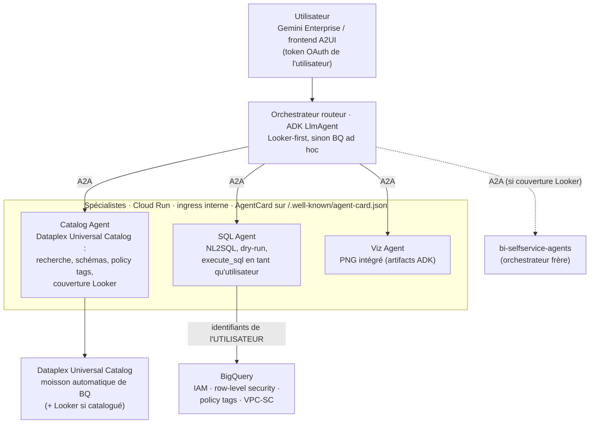
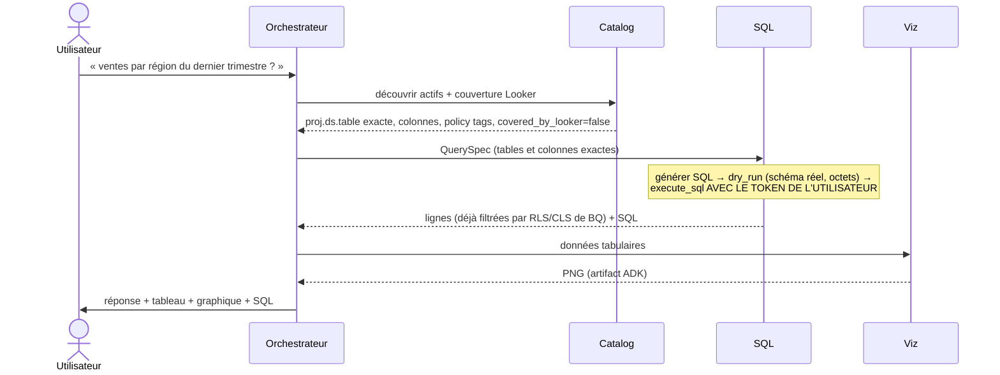

# bq-adhoc-agents

🌐 [Español](README.md) · [English](README.en.md) · **Français** · [Deutsch](README.de.md) · [Português](README.pt.md)

Système multi-agents complémentaire à [bi-selfservice-agents](https://github.com/joseimj/bi-selfservice-agents) pour le libre-service analytique sur la **longue traîne des données BigQuery non intégrées à Looker**. À partir d'une requête en langage naturel, les agents découvrent les actifs pertinents dans **Dataplex Universal Catalog** (le catalogue de connaissances de GCP, qui moissonne BigQuery automatiquement), génèrent du SQL validé contre le schéma réel, l'exécutent **avec l'identité de l'utilisateur final** — de sorte que BigQuery applique lui-même son contrôle d'accès — et répondent aux questions métier avec des tableaux et des graphiques intégrés. Construit sur ADK, communication interne A2A, deux surfaces (Gemini Enterprise et frontend A2UI), déploiement Terraform.

## 1. Contexte : pourquoi deux systèmes et non un seul

`bi-selfservice-agents` résout le libre-service sur les données **gouvernées** : la couche sémantique LookML est la source unique des métriques, le Builder matérialise des dashboards natifs, et le plafond de permissions est le permission set de l'utilisateur de service Looker. Ce design est correct pour son périmètre — mais il laisse de côté deux réalités de toute organisation :

1. **Données non modélisées.** La majorité des tables BigQuery n'atteignent jamais LookML : staging, nouveaux domaines, datasets d'équipes sans BI dédiée, résultats de pipelines exploratoires. Aujourd'hui, la seule façon de les interroger est de connaître SQL.
2. **Permissions hétérogènes.** Dans Looker, l'accès est médié par le modèle ; dans BigQuery brut, l'accès est défini par IAM, la row-level security, les policy tags (masquage de colonnes) et VPC-SC — **par utilisateur**. Un service account aux accès étendus casserait ce modèle.

Ce système couvre exactement ce vide, et traite Looker comme **cœur préféré, pas comme règle** : si le catalogue indique que la donnée est bien modélisée dans Looker, l'orchestrateur propose de déléguer au système frère (métrique gouvernée > SQL ad hoc) ; sinon — ou si l'utilisateur opère sans Looker moderne — la route BQ ad hoc s'active.

| | bi-selfservice-agents | bq-adhoc-agents (ce dépôt) |
|---|---|---|
| Source de vérité sémantique | LookML | Dataplex Universal Catalog |
| Identité d'exécution | Utilisateur de service Looker | **Utilisateur final (OAuth)** |
| Contrôle d'accès | Permission set / model set de Looker | IAM + RLS + policy tags de BQ, appliqués par BQ |
| Résultat | Dashboard persistant et gouverné | Réponse + tableau + graphique éphémère |
| Écriture | Oui (dashboards dans un dossier délimité) | **Non** (`WriteMode.BLOCKED`) |
| Barrière anti-hallucination | Catalog Agent vs LookML + preview_query | Catalog Agent vs Dataplex + **dry-run** |

## 2. Architecture



### Responsabilités

| Agent | Runtime | Responsabilité | Outils principaux |
|---|---|---|---|
| **Orchestrator** | Agent Engine (+ Cloud Run optionnel A2A/A2UI) | Interprète la requête, route Looker-first vs BQ ad hoc, négocie la `QuerySpec`, synthétise la réponse | sous-agents `RemoteA2aAgent` |
| **Catalog** | Cloud Run (ingress interne) | Autorité en lecture seule sur Dataplex : découvre les actifs par termes métier, résout schémas exacts et policy tags, détermine la couverture Looker | `search_catalog`, `get_entry_details`, `check_looker_coverage` |
| **SQL** | Cloud Run (ingress interne) | Seule voie de consultation des données : NL2SQL, validation par dry-run, exécution avec les identifiants de l'utilisateur | `dry_run_sql`, `BigQueryToolset` d'ADK (`get_table_info`, `execute_sql`, optionnel `ask_data_insights`) |
| **Viz** | Cloud Run (ingress interne) | Graphiques à partir de résultats déjà autorisés ; PNG comme artifacts ADK | `render_chart` (matplotlib) |

### Cycle de vie d'une requête



## 3. Contrôle d'accès : la décision de design centrale

**L'agent ne décide jamais de ce que l'utilisateur peut voir ; c'est BigQuery qui décide.** Chaque requête s'exécute avec les identifiants de l'utilisateur final. Le `BigQueryToolset` first-party d'ADK le supporte nativement via `BigQueryCredentialsConfig` :

- **Gemini Enterprise** gère le token OAuth de l'utilisateur et ADK le lit depuis le session state via `external_access_token_key` (en enregistrant une *Authorization* dans GE avec le scope `bigquery.readonly`). C'est le mode par défaut (`EUC_MODE=gemini_enterprise`).
- **Frontend propre (A2UI)** : flux OAuth 2.0 interactif avec `client_id`/`client_secret` — ADK déclenche le login et persiste le token en session (`EUC_MODE=oauth_interactive`).
- **ADC** uniquement pour le développement local.

Conséquences obtenues *gratuitement*, sans logique dans les agents :

- **IAM** : l'utilisateur ne consulte que les datasets/tables où il détient `bigquery.dataViewer` (ou des vues autorisées).
- **Row-level security** : les row access policies filtrent les lignes par identité — deux utilisateurs posant la même question reçoivent des réponses différentes, à juste titre.
- **Policy tags / masquage de colonnes** : les colonnes sensibles arrivent masquées ou refusées selon les taxonomy grants de l'utilisateur ; le Catalog Agent les anticipe (il les lit dans les métadonnées) pour que l'orchestrateur puisse l'expliquer.
- **Audit attribuable** : chaque job BQ est journalisé au nom de l'utilisateur dans Cloud Audit Logs, avec des `job_labels` (`origin=bq-adhoc-agents`) pour filtrer dans `INFORMATION_SCHEMA.JOBS`.

Le service account des agents est réduit aux permissions de plateforme (logging, artifacts, `dataplex.catalogViewer` pour la moisson de métadonnées) — **il n'a aucun accès aux données métier**. Garde-fous supplémentaires par construction : `WriteMode.BLOCKED` (le système est incapable de muter des données), `maximum_bytes_billed` par requête, plafond de lignes vers le contexte du LLM, et une allowlist optionnelle de datasets (`BQ_DATASET_ALLOWLIST`) en défense en profondeur.

**Règle de comportement** : un `403` ou un résultat filtré par RLS, c'est le système qui fonctionne. Le prompt du SQL Agent interdit explicitement de reformuler des requêtes pour contourner un refus ; la réponse correcte est d'expliquer et d'orienter vers le data owner.

## 4. Dataplex Universal Catalog comme couche sémantique de facto

En l'absence de LookML, le catalogue joue le rôle de barrière anti-hallucination :

- **Moisson automatique** : chaque table/vue BQ apparaît dans le catalogue sans onboarding manuel, avec schéma, descriptions et policy tags.
- **Recherche par termes métier** : `search_catalog` traduit « ventes », « churn », « inventaire » en actifs concrets ; le glossaire métier et les aspects enrichissent le classement.
- **Contrat de noms exacts** : le SQL Agent n'accepte que des `project.dataset.table` et des colonnes résolus par le Catalog Agent — le modèle ne « se souvient » jamais du schéma, il le consulte. Le **dry-run** est la deuxième barrière : il valide syntaxe, schéma réel et coût estimé avant d'exécuter.
- **Routage Looker-first** : si l'organisation a catalogué son instance Looker dans Dataplex, `check_looker_coverage` détecte si un actif est déjà modélisé (entrées `looker:`) et l'orchestrateur propose la route gouvernée du dépôt frère via A2A (`LOOKER_ORCHESTRATOR_URL`). Si la couverture est `unknown` ou si l'utilisateur n'a pas Looker (p. ex. Looker Original sans surface self-service), on continue par la route BQ. Looker est une préférence, pas une exigence.

## 5. Configuration

| Variable | Portée | Description |
|---|---|---|
| `AGENT_MODEL_PROVIDER` | tous | `gemini` \| `claude` \| `claude_native` \| `anthropic` (override par agent : `SQL_MODEL_PROVIDER`, etc.) |
| `GOOGLE_CLOUD_PROJECT_ID` | tous | Projet GCP |
| `EUC_MODE` | sql | `gemini_enterprise` \| `oauth_interactive` \| `adc` |
| `GE_AUTH_ID` | sql | Clé du token utilisateur dans le session state (Authorization GE) |
| `OAUTH_CLIENT_ID` / `OAUTH_CLIENT_SECRET` | sql | Uniquement en mode `oauth_interactive` |
| `BQ_BILLING_PROJECT` | sql | Projet de calcul/facturation des requêtes |
| `BQ_MAX_BYTES_BILLED` | sql | Plafond par requête (défaut 10 Gio) |
| `BQ_MAX_RESULT_ROWS` | sql | Lignes maximales vers le LLM (défaut 200) |
| `BQ_DATASET_ALLOWLIST` | catalog | Allowlist optionnelle de datasets (défense en profondeur) |
| `DATAPLEX_LOCATION` | catalog | Location du catalogue (défaut `global`) |
| `CATALOG/SQL/VIZ_AGENT_URL` | orchestrateur | Endpoints A2A des spécialistes |
| `LOOKER_ORCHESTRATOR_URL` | orchestrateur | Optionnel : orchestrateur de bi-selfservice-agents pour la route gouvernée |
| `PUBLIC_URL` | spécialistes | URL annoncée par l'AgentCard (Cloud Run) |

## 6. Prérequis

- Projet GCP avec facturation ; APIs : BigQuery, Dataplex, Vertex AI, Cloud Run, Secret Manager.
- **OAuth** : écran de consentement + client ID ; dans Gemini Enterprise, enregistrer une *Authorization* avec le scope `https://www.googleapis.com/auth/bigquery.readonly` et utiliser son id comme `GE_AUTH_ID`.
- SA des agents avec : `logging.logWriter`, `dataplex.catalogViewer`, `aiplatform.user`. **Aucun rôle de données BQ.**
- Utilisateurs finaux avec leurs permissions BQ habituelles (IAM/RLS/policy tags déjà configurés par les data owners : le système n'ajoute ni ne retire rien).
- Optionnel : instance Looker cataloguée dans Dataplex (pour le routage Looker-first) et `bi-selfservice-agents` déployé (pour la délégation A2A).

## 7. Déploiement

Le pattern est identique au dépôt frère et le Terraform est réutilisable quasiment 1:1 : Artifact Registry + Cloud Build par agent (contexte partagé avec `common/`), trois Cloud Run avec ingress interne et invocation authentifiée par IAM (`roles/run.invoker` pour la SA de l'orchestrateur), orchestrateur sur Agent Engine enregistré dans Gemini Enterprise. Ce qui change : les variables d'environnement (§5), la SA sans rôles de données, et l'Authorization GE pour le token utilisateur.

```bash
cd terraform
cp terraform.tfvars.example terraform.tfvars
terraform init && terraform apply
```

Développement local :

```bash
pip install -r agents/requirements.txt
export EUC_MODE=adc GOOGLE_CLOUD_PROJECT_ID=mon-projet
adk web agents/
```

## 8. Flux d'exemple

> « Quel a été le panier moyen par région en juin ? Montre-le en graphique à barres. »

1. **Catalog** trouve `analytics.orders_raw` dans Dataplex (non couverte par Looker), renvoie les colonnes exactes (`region`, `order_total`, `created_at`) et marque `customer_email` comme policy-tagged.
2. L'orchestrateur confirme la `QuerySpec` et délègue au **SQL Agent**, qui génère le SQL, le valide en dry-run (0,4 Gio, dans le budget) et l'exécute **avec le token de l'utilisateur**. Si l'utilisateur a une row access policy le limitant à la région Nord, la réponse ne contient que la région Nord — sans qu'aucun agent ne l'ait décidé.
3. **Viz** rend le PNG à barres comme artifact ; l'orchestrateur répond avec le chiffre, le graphique et le SQL utilisé.
4. Si la même question avait résolu vers un explore Looker, l'orchestrateur aurait proposé : « Cette donnée est déjà gouvernée dans Looker ; voulez-vous un dashboard persistant ? » → délégation A2A au système frère.

## 9. Règles de qualité : proposer (LLM) / approuver (steward) / appliquer (CI)

Les agents peuvent porter des règles de qualité vers le catalogue (Dataplex AutoDQ), mais avec une stricte séparation des pouvoirs — aucun LLM n'écrit la gouvernance :

1. **Proposer (Catalog Agent).** `profile_table_for_rules` profile la table et l'agent dérive des règles candidates (non_null, uniqueness, set, range, regex, row_condition, sql_assertion) présentées en langage métier. Après confirmation de l'utilisateur, `submit_quality_proposal` sérialise la proposition en YAML (`rules/{project}/{dataset}/{table}.yaml`) et ouvre une **PR/MR dans le dépôt de gouvernance** (`dq-rules-repo/`). Le fournisseur Git est de la configuration : `GIT_PROVIDER=github|gitlab|bitbucket` avec des adaptateurs dans `common/git_provider.py` (même interface : branche → commit → PR), de sorte que des domaines différents peuvent être gouvernés sur des plateformes différentes.
2. **Approuver (data steward, humain).** Revue là où ils révisent déjà tout : Git — diff, commentaires, CODEOWNERS par domaine, branche `main` protégée. Le pipeline valide la proposition sur la PR (`apply.py validate`). L'identité de l'approbateur est garantie par la plateforme Git, pas par le chat.
3. **Appliquer (CI déterministe).** Le merge déclenche `apply.py apply`, qui crée/met à jour le DataScan et lance la première exécution. La **seule** identité avec `roles/dataplex.dataScanEditor` est la SA de gouvernance du CI (via Workload Identity Federation, sans clés). Ni les utilisateurs ni les agents n'ont besoin de permissions d'écriture sur Dataplex : le LLM est structurellement incapable d'écrire la gouvernance.

Les trois CIs (GitHub Actions, GitLab CI, Bitbucket Pipelines) invoquent le même `apply.py`. Les scores publiés par les scans deviennent des aspects du catalogue que le Catalog Agent lit déjà — l'orchestrateur peut signaler la fiabilité d'une table en répondant. Rollback = revert de la PR.

**Comment les stewards sont informés.** Trois couches : (a) assignation automatique par domaine — `CODEOWNERS` sur GitHub/GitLab (Bitbucket : default reviewers) assigne le bon steward et la branch protection exige son approbation, avec la notification native de la plateforme ; (b) notification uniforme au chat — l'étape `validate` publie sur le webhook de l'espace des stewards (`CHAT_WEBHOOK_URL`), même mécanisme sur les trois CIs ; (c) optionnellement, un rappel planifié (Cloud Scheduler) listant les PR ouvertes >N jours.

**Métadonnées Dataplex injectées dans la revue.** `governance_report.py` s'exécute dans le `validate` de chaque PR avec la SA lectrice et publie en commentaire (via `post_comment.py`, multi-plateforme) un rapport VIVANT du catalogue : description de l'entry, vérification colonne par colonne contre le schéma actuel (colonne inexistante = pipeline bloqué), policy tags sur les colonnes des règles, score de qualité en vigueur si un scan existe déjà, et volume de la table comme proxy de coût. Le steward approuve avec un contexte frais, pas avec ce que l'agent a vu en proposant. Post-merge, les résultats du scan reviennent au catalogue comme aspects que le Catalog Agent lit — boucle fermée.

Variables : `GIT_PROVIDER`, `GIT_REPO`, `GIT_BASE_BRANCH`, `GIT_TOKEN` (Secret Manager), `GIT_API_BASE` (self-hosted), `DATAPLEX_DQ_LOCATION` (les DataScans sont régionaux), `CHAT_WEBHOOK_URL` (secret du CI).

**Identités (Terraform inclus) :** `bq-adhoc-agents` (runtime, sans données) · `dq-rules-reader` (validate : catalogViewer, dataScanViewer, bq metadataViewer) · `dq-rules-governance` (apply : dataScanEditor, la seule avec écriture). Un pool de Workload Identity Federation avec trois providers (GitHub/GitLab/Bitbucket) permet aux CIs d'assumer ces SAs sans clés, avec un **double verrou dans IAM** : la SA lectrice est assumable depuis n'importe quel événement du dépôt de gouvernance, mais celle de gouvernance uniquement depuis l'événement de merge vers la branche protégée — sur GitHub via l'attribut `repository@ref` (`...@refs/heads/main` ; les PR portent `refs/pull/N/merge` et ne matchent jamais), sur GitLab via `project_path@ref` (les pipelines de MR portent le ref de la branche source), et sur Bitbucket — dont le token OIDC n'inclut pas la branche — via le `deploymentEnvironmentUuid` d'un deployment environment restreint à `main` dans la configuration du dépôt (l'étape `apply` déclare `deployment: production`). Ainsi, même si quelqu'un altérait un pipeline sur une branche, l'échange de token vers la SA d'écriture échoue dans IAM, pas seulement dans la politique du dépôt. Branch protection + CODEOWNERS restent nécessaires : ce sont eux qui garantissent qu'atteindre `main` a exigé l'approbation du steward.

## 10. Évolution prévue

- **Onboarding Agent** : quand une question ad hoc se répète, proposer l'onboarding de l'actif vers LookML en pull request — même pattern proposer/approuver/appliquer du §9, en réutilisant `git_provider.py` ; le `LookML Author Agent` prévu dans le dépôt frère en est le récepteur naturel.
- **`ask_data_insights`** : déléguer le NL2SQL à la Conversational Analytics API (même toolset ADK, mêmes identifiants utilisateur) une fois activée dans l'organisation.
- **Semantic caching** des QuerySpecs fréquentes et **évaluation continue** avec une batterie de questions de référence contre le staging.

## Auteur

**Jose Maldonado** ([@joseimj](https://github.com/joseimj)) — également auteur de [bi-selfservice-agents](https://github.com/joseimj/bi-selfservice-agents), le système frère que ce dépôt complète.
