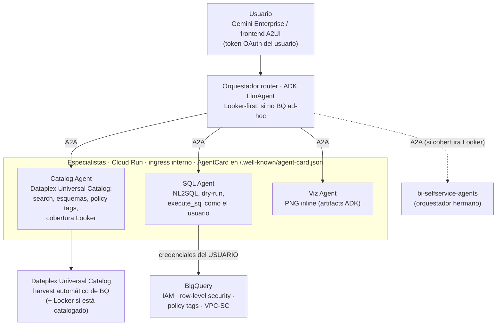
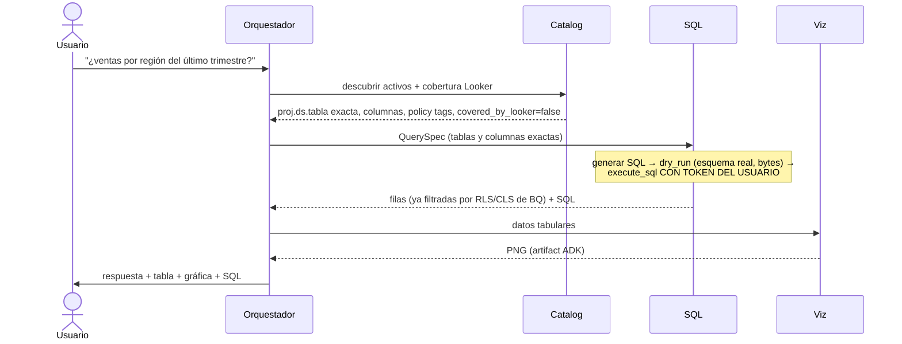

# bq-adhoc-agents

Sistema multi-agente complementario a [bi-selfservice-agents](https://github.com/joseimj/bi-selfservice-agents) para autoservicio analítico sobre la **larga cola de datos de BigQuery que no está onboardeada en Looker**. A partir de una petición en lenguaje natural, los agentes descubren los activos relevantes en **Dataplex Universal Catalog** (el catálogo de conocimiento de GCP, que harvestea BigQuery automáticamente), generan SQL validado contra el esquema real, lo ejecutan **con la identidad del usuario final** — de modo que BigQuery aplica su propio control de acceso — y responden preguntas de negocio con tablas y gráficas inline. Construido sobre ADK, comunicación interna por A2A, dos superficies (Gemini Enterprise y frontend A2UI), despliegue con Terraform.

## 1. Contexto: por qué dos sistemas y no uno

`bi-selfservice-agents` resuelve el autoservicio sobre datos **gobernados**: la capa semántica LookML es la fuente única de métricas, el Builder materializa dashboards nativos, y el techo de permisos es el permission set del usuario de servicio de Looker. Ese diseño es correcto para su alcance — pero deja fuera dos realidades de cualquier organización:

1. **Datos no modelados.** La mayoría de las tablas de BigQuery nunca llegan a LookML: staging, dominios nuevos, datasets de equipos sin BI dedicado, resultados de pipelines exploratorios. Hoy, la única forma de preguntarles algo es saber SQL.
2. **Permisos heterogéneos.** En Looker el acceso lo media el modelo; en BigQuery crudo el acceso lo definen IAM, row-level security, policy tags (enmascaramiento de columnas) y VPC-SC — **por usuario**. Un service account con acceso amplio rompería ese modelo.

Este sistema cubre exactamente ese hueco, y trata a Looker como **core preferido, no como regla**: si el catálogo indica que el dato sí está modelado en Looker, el orquestador propone delegar al sistema hermano (métrica gobernada > SQL ad-hoc); si no lo está — o el usuario opera sin Looker moderno — entra la ruta BQ ad-hoc.

| | bi-selfservice-agents | bq-adhoc-agents (este repo) |
|---|---|---|
| Fuente de verdad semántica | LookML | Dataplex Universal Catalog |
| Identidad de ejecución | Service user de Looker | **Usuario final (OAuth)** |
| Control de acceso | Permission set / model set de Looker | IAM + RLS + policy tags de BQ, aplicados por BQ |
| Resultado | Dashboard persistente y gobernado | Respuesta + tabla + gráfica efímera |
| Escritura | Sí (dashboards en folder acotado) | **No** (`WriteMode.BLOCKED`) |
| Barrera anti-alucinación | Catalog Agent vs LookML + preview_query | Catalog Agent vs Dataplex + **dry-run** |

## 2. Arquitectura



### Responsabilidades

| Agente | Runtime | Responsabilidad | Tools principales |
|---|---|---|---|
| **Orchestrator** | Agent Engine (+ Cloud Run opcional A2A/A2UI) | Interpreta la petición, rutea Looker-first vs BQ ad-hoc, negocia la `QuerySpec`, sintetiza la respuesta | sub-agentes `RemoteA2aAgent` |
| **Catalog** | Cloud Run (ingress interno) | Autoridad de solo lectura sobre Dataplex: descubre activos por términos de negocio, resuelve esquemas exactos y policy tags, determina cobertura Looker | `search_catalog`, `get_entry_details`, `check_looker_coverage` |
| **SQL** | Cloud Run (ingress interno) | Única ruta de consulta a datos: NL2SQL, validación por dry-run, ejecución con credenciales del usuario | `dry_run_sql`, `BigQueryToolset` de ADK (`get_table_info`, `execute_sql`, opcional `ask_data_insights`) |
| **Viz** | Cloud Run (ingress interno) | Gráficas a partir de resultados ya autorizados; PNG como artifacts ADK | `render_chart` (matplotlib) |

### Ciclo de vida de una petición



## 3. Control de acceso: la decisión de diseño central

**El agente nunca decide qué puede ver el usuario; lo decide BigQuery.** Toda query se ejecuta con credenciales del usuario final. El `BigQueryToolset` de primera parte de ADK soporta esto de fábrica vía `BigQueryCredentialsConfig`:

- **Gemini Enterprise** gestiona el token OAuth del usuario y ADK lo lee del session state con `external_access_token_key` (registrando una *Authorization* en GE con scope `bigquery.readonly`). Es el modo por defecto (`EUC_MODE=gemini_enterprise`).
- **Frontend propio (A2UI)**: flujo OAuth 2.0 interactivo con `client_id`/`client_secret` — ADK dispara el login y persiste el token en sesión (`EUC_MODE=oauth_interactive`).
- **ADC** solo para desarrollo local.

Consecuencias que se obtienen *gratis*, sin lógica en los agentes:

- **IAM**: el usuario solo consulta datasets/tablas donde tiene `bigquery.dataViewer` (o vistas autorizadas).
- **Row-level security**: las row access policies filtran filas por identidad — dos usuarios que hacen la misma pregunta reciben respuestas distintas, correctamente.
- **Policy tags / column masking**: columnas sensibles llegan enmascaradas o denegadas según los taxonomy grants del usuario; el Catalog Agent las anticipa (las lee de la metadata) para que el orquestador pueda explicarlo.
- **Auditoría atribuible**: cada job de BQ queda registrado a nombre del usuario en Cloud Audit Logs, con `job_labels` (`origin=bq-adhoc-agents`) para filtrar en `INFORMATION_SCHEMA.JOBS`.

La service account de los agentes queda reducida a permisos de plataforma (logging, artifacts, `dataplex.catalogViewer` para el harvest de metadata) — **no tiene acceso a datos de negocio**. Guardrails adicionales por construcción: `WriteMode.BLOCKED` (el sistema es incapaz de mutar datos), `maximum_bytes_billed` por query, tope de filas hacia el contexto del LLM, y una allowlist opcional de datasets (`BQ_DATASET_ALLOWLIST`) como defensa en profundidad.

**Regla de comportamiento**: un `403` o un resultado filtrado por RLS es el sistema funcionando. El prompt del SQL Agent prohíbe explícitamente reformular queries para rodear una denegación; la respuesta correcta es explicar y dirigir al data owner.

## 4. Dataplex Universal Catalog como capa semántica de facto

En ausencia de LookML, el catálogo hace el papel de barrera anti-alucinación:

- **Harvest automático**: toda tabla/vista de BQ aparece en el catálogo sin onboarding manual, con esquema, descripciones y policy tags.
- **Búsqueda por términos de negocio**: `search_catalog` traduce "ventas", "churn", "inventario" a activos concretos; el glosario de negocio y los aspectos enriquecen el ranking.
- **Contrato de nombres exactos**: el SQL Agent solo acepta `project.dataset.table` y columnas resueltas por el Catalog Agent — el modelo nunca "recuerda" el esquema, lo consulta. El **dry-run** es la segunda barrera: valida sintaxis, esquema real y costo estimado antes de ejecutar.
- **Routing Looker-first**: si la organización catalogó su instancia de Looker en Dataplex, `check_looker_coverage` detecta si un activo ya está modelado (entradas `looker:`) y el orquestador propone la ruta gobernada del repo hermano vía A2A (`LOOKER_ORCHESTRATOR_URL`). Si la cobertura es `unknown` o el usuario no tiene Looker (p. ej. Looker Original sin superficie self-service), se continúa por la ruta BQ. Looker es preferencia, no requisito.

## 5. Configuración

| Variable | Ámbito | Descripción |
|---|---|---|
| `AGENT_MODEL_PROVIDER` | todos | `gemini` \| `claude` \| `claude_native` \| `anthropic` (override por agente: `SQL_MODEL_PROVIDER`, etc.) |
| `GOOGLE_CLOUD_PROJECT_ID` | todos | Proyecto GCP |
| `EUC_MODE` | sql | `gemini_enterprise` \| `oauth_interactive` \| `adc` |
| `GE_AUTH_ID` | sql | Clave del token de usuario en session state (Authorization de GE) |
| `OAUTH_CLIENT_ID` / `OAUTH_CLIENT_SECRET` | sql | Solo modo `oauth_interactive` |
| `BQ_BILLING_PROJECT` | sql | Proyecto de cómputo/facturación de las queries |
| `BQ_MAX_BYTES_BILLED` | sql | Techo por query (default 10 GiB) |
| `BQ_MAX_RESULT_ROWS` | sql | Filas máximas hacia el LLM (default 200) |
| `BQ_DATASET_ALLOWLIST` | catalog | Allowlist opcional de datasets (defensa en profundidad) |
| `DATAPLEX_LOCATION` | catalog | Location del catálogo (default `global`) |
| `CATALOG/SQL/VIZ_AGENT_URL` | orquestador | Endpoints A2A de los especialistas |
| `LOOKER_ORCHESTRATOR_URL` | orquestador | Opcional: orquestador de bi-selfservice-agents para la ruta gobernada |
| `PUBLIC_URL` | especialistas | URL que anuncia el AgentCard (Cloud Run) |

## 6. Prerrequisitos

- Proyecto GCP con billing; APIs: BigQuery, Dataplex, Vertex AI, Cloud Run, Secret Manager.
- **OAuth**: pantalla de consentimiento + client ID; en Gemini Enterprise, registrar una *Authorization* con scope `https://www.googleapis.com/auth/bigquery.readonly` y usar su id como `GE_AUTH_ID`.
- SA de agentes con: `logging.logWriter`, `dataplex.catalogViewer`, `aiplatform.user`. **Sin roles de datos de BQ.**
- Usuarios finales con sus permisos normales de BQ (IAM/RLS/policy tags ya configurados por los data owners: el sistema no añade ni quita nada).
- Opcional: instancia de Looker catalogada en Dataplex (para el routing Looker-first) y `bi-selfservice-agents` desplegado (para la delegación A2A).

## 7. Despliegue

El patrón es idéntico al repo hermano y el Terraform es reutilizable casi 1:1: Artifact Registry + Cloud Build por agente (contexto compartido con `common/`), tres Cloud Run con ingress interno e invocación autenticada por IAM (`roles/run.invoker` para la SA del orquestador), orquestador en Agent Engine con registro en Gemini Enterprise. Cambian: las variables de entorno (§5), la SA sin roles de datos, y la Authorization de GE para el token de usuario.

```bash
cd terraform
cp terraform.tfvars.example terraform.tfvars
terraform init && terraform apply
```

Desarrollo local:

```bash
pip install -r agents/requirements.txt
export EUC_MODE=adc GOOGLE_CLOUD_PROJECT_ID=mi-proyecto
adk web agents/
```

## 8. Flujo de ejemplo

> «¿Cuál fue el ticket promedio por región en junio? Muéstramelo en una gráfica de barras.»

1. **Catalog** encuentra `analytics.orders_raw` en Dataplex (no cubierta por Looker), devuelve columnas exactas (`region`, `order_total`, `created_at`) y marca `customer_email` como policy-tagged.
2. El orquestador confirma la `QuerySpec` y delega al **SQL Agent**, que genera el SQL, lo valida con dry-run (0.4 GiB, dentro de presupuesto) y lo ejecuta **con el token del usuario**. Si el usuario tiene una row access policy que lo limita a la región Norte, la respuesta solo contiene la región Norte — sin que ningún agente lo haya decidido.
3. **Viz** renderiza el PNG de barras como artifact; el orquestador responde con la cifra, la gráfica y el SQL usado.
4. Si la misma pregunta hubiera resuelto a un explore de Looker, el orquestador habría ofrecido: «Este dato ya está gobernado en Looker; ¿quieres un dashboard persistente?» → delegación A2A al sistema hermano.

## 9. Reglas de calidad: proponer (LLM) / aprobar (steward) / aplicar (CI)

Los agentes pueden llevar reglas de calidad hacia el catálogo (Dataplex AutoDQ), pero con separación estricta de poderes — ningún LLM escribe gobierno:

1. **Proponer (Catalog Agent).** `profile_table_for_rules` perfila la tabla y el agente deriva reglas candidatas (non_null, uniqueness, set, range, regex, row_condition, sql_assertion) que presenta en lenguaje de negocio. Con la confirmación del usuario, `submit_quality_proposal` serializa la propuesta como YAML (`rules/{project}/{dataset}/{table}.yaml`) y abre un **PR/MR en el repo de gobierno** (`dq-rules-repo/`). El proveedor Git es configuración: `GIT_PROVIDER=github|gitlab|bitbucket` con adaptadores en `common/git_provider.py` (misma interfaz: rama → commit → PR), de modo que dominios distintos pueden gobernarse en plataformas distintas.
2. **Aprobar (data steward, humano).** Revisión donde ya revisan todo: Git — diff, comentarios, CODEOWNERS por dominio, rama `main` protegida. El pipeline valida la propuesta en el PR (`apply.py validate`). La identidad del aprobador la garantiza la plataforma Git, no el chat.
3. **Aplicar (CI determinista).** El merge dispara `apply.py apply`, que crea/actualiza el DataScan y lanza la primera corrida. La **única** identidad con `roles/dataplex.dataScanEditor` es la SA de gobierno del CI (vía Workload Identity Federation, sin llaves). Ni usuarios ni agentes necesitan permisos de escritura sobre Dataplex: el LLM es estructuralmente incapaz de escribir gobierno.

Los tres CIs (GitHub Actions, GitLab CI, Bitbucket Pipelines) invocan el mismo `apply.py`. Los scores publicados por los scans se vuelven aspectos del catálogo que el Catalog Agent ya lee — el orquestador puede advertir la confiabilidad de una tabla al responder. Rollback = revert del PR.

**Cómo se enteran los stewards.** Tres capas: (a) asignación automática por dominio — `CODEOWNERS` en GitHub/GitLab (Bitbucket: default reviewers) asigna al steward correcto y branch protection exige su aprobación, con la notificación nativa de la plataforma; (b) notificación uniforme a chat — el paso `validate` publica al webhook del espacio de stewards (`CHAT_WEBHOOK_URL`), mismo mecanismo en los tres CIs; (c) opcional, un recordatorio programado (Cloud Scheduler) que lista PRs abiertos >N días.

**Metadata de Dataplex inyectada en la revisión.** `governance_report.py` corre en el `validate` de cada PR con la SA lectora y publica como comentario (via `post_comment.py`, multi-plataforma) un reporte VIVO del catálogo: descripción del entry, verificación columna-a-columna contra el esquema actual (columna inexistente = pipeline bloqueado), policy tags sobre las columnas de las reglas, score de calidad vigente si ya existe scan, y volumen de la tabla como proxy de costo. El steward aprueba con contexto fresco, no con lo que el agente vio al proponer. Post-merge, los resultados del scan regresan al catálogo como aspectos que el Catalog Agent lee — ciclo cerrado.

Variables: `GIT_PROVIDER`, `GIT_REPO`, `GIT_BASE_BRANCH`, `GIT_TOKEN` (Secret Manager), `GIT_API_BASE` (self-hosted), `DATAPLEX_DQ_LOCATION` (los DataScans son regionales), `CHAT_WEBHOOK_URL` (secreto del CI).

**Identidades (Terraform incluido):** `bq-adhoc-agents` (runtime, sin datos) · `dq-rules-reader` (validate: catalogViewer, dataScanViewer, bq metadataViewer) · `dq-rules-governance` (apply: dataScanEditor, la única con escritura). Un pool de Workload Identity Federation con tres providers (GitHub/GitLab/Bitbucket) permite a los CIs asumir esas SAs sin llaves, con **doble candado en IAM**: la SA lectora es asumible desde cualquier evento del repo de gobierno, pero la de gobernanza solo desde el evento de merge a la rama protegida — en GitHub vía el atributo `repository@ref` (`...@refs/heads/main`; los PRs traen `refs/pull/N/merge` y nunca matchean), en GitLab vía `project_path@ref` (los pipelines de MR llevan el ref de la rama fuente), y en Bitbucket — cuyo token OIDC no incluye rama — vía el `deploymentEnvironmentUuid` de un deployment environment restringido a `main` en la configuración del repo (el step `apply` declara `deployment: production`). Así, incluso si alguien alterara un pipeline en una rama, el intercambio de token hacia la SA de escritura falla en IAM, no solo en la política del repo. Branch protection + CODEOWNERS siguen siendo necesarios: son quienes garantizan que llegar a `main` requirió la aprobación del steward.

## 10. Evolución prevista

- **Onboarding Agent**: cuando una pregunta ad-hoc se repite, proponer el onboarding del activo a LookML como pull request — mismo patrón proponer/aprobar/aplicar de §9, reutilizando `git_provider.py`; el `LookML Author Agent` previsto en el repo hermano es el receptor natural.
- **`ask_data_insights`**: delegar el NL2SQL a la Conversational Analytics API (mismo toolset de ADK, mismas credenciales de usuario) cuando esté habilitada en la organización.
- **Semantic caching** de QuerySpecs frecuentes y **evaluación continua** con batería de preguntas de referencia contra staging.
