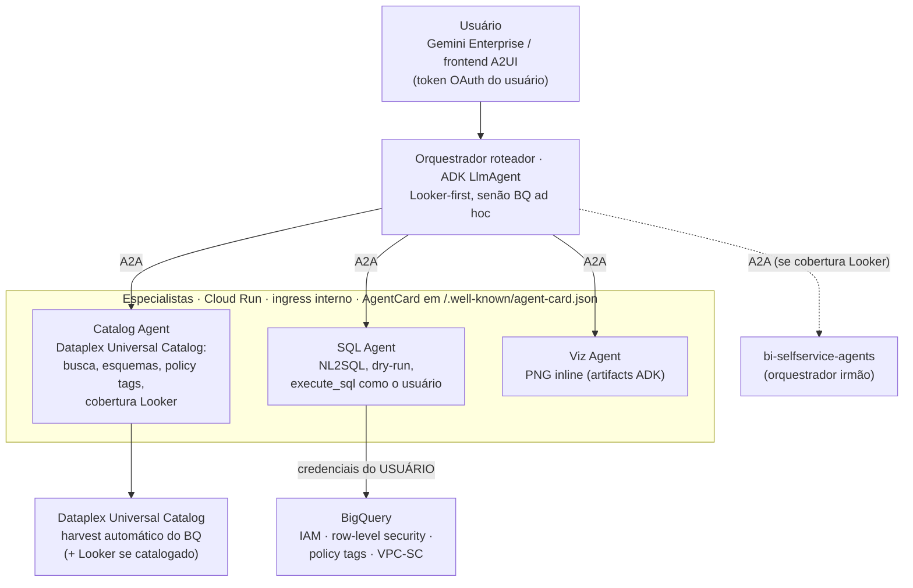
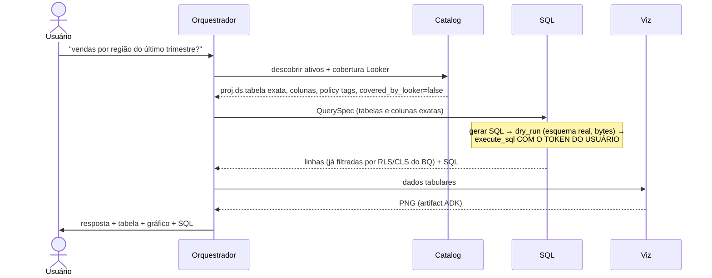

# bq-adhoc-agents

🌐 [Español](README.md) · [English](README.en.md) · [Français](README.fr.md) · [Deutsch](README.de.md) · **Português**

Sistema multiagente complementar ao [bi-selfservice-agents](https://github.com/joseimj/bi-selfservice-agents) para autoatendimento analítico sobre a **cauda longa de dados do BigQuery que não está onboardada no Looker**. A partir de um pedido em linguagem natural, os agentes descobrem os ativos relevantes no **Dataplex Universal Catalog** (o catálogo de conhecimento do GCP, que faz harvest do BigQuery automaticamente), geram SQL validado contra o esquema real, executam-no **com a identidade do usuário final** — de modo que o BigQuery aplica seu próprio controle de acesso — e respondem perguntas de negócio com tabelas e gráficos inline. Construído sobre ADK, comunicação interna via A2A, duas superfícies (Gemini Enterprise e frontend A2UI), implantação com Terraform.

## 1. Contexto: por que dois sistemas e não um

O `bi-selfservice-agents` resolve o autoatendimento sobre dados **governados**: a camada semântica LookML é a fonte única de métricas, o Builder materializa dashboards nativos, e o teto de permissões é o permission set do usuário de serviço do Looker. Esse design é correto para seu escopo — mas deixa de fora duas realidades de qualquer organização:

1. **Dados não modelados.** A maioria das tabelas do BigQuery nunca chega ao LookML: staging, domínios novos, datasets de equipes sem BI dedicado, resultados de pipelines exploratórios. Hoje, a única forma de perguntar algo a elas é saber SQL.
2. **Permissões heterogêneas.** No Looker, o acesso é mediado pelo modelo; no BigQuery bruto, o acesso é definido por IAM, row-level security, policy tags (mascaramento de colunas) e VPC-SC — **por usuário**. Uma service account com acesso amplo quebraria esse modelo.

Este sistema cobre exatamente essa lacuna, e trata o Looker como **núcleo preferido, não como regra**: se o catálogo indica que o dado está modelado no Looker, o orquestrador propõe delegar ao sistema irmão (métrica governada > SQL ad hoc); se não está — ou o usuário opera sem Looker moderno — entra a rota BQ ad hoc.

| | bi-selfservice-agents | bq-adhoc-agents (este repo) |
|---|---|---|
| Fonte de verdade semântica | LookML | Dataplex Universal Catalog |
| Identidade de execução | Usuário de serviço do Looker | **Usuário final (OAuth)** |
| Controle de acesso | Permission set / model set do Looker | IAM + RLS + policy tags do BQ, aplicados pelo BQ |
| Resultado | Dashboard persistente e governado | Resposta + tabela + gráfico efêmero |
| Escrita | Sim (dashboards em pasta delimitada) | **Não** (`WriteMode.BLOCKED`) |
| Barreira anti-alucinação | Catalog Agent vs LookML + preview_query | Catalog Agent vs Dataplex + **dry-run** |

## 2. Arquitetura



### Responsabilidades

| Agente | Runtime | Responsabilidade | Ferramentas principais |
|---|---|---|---|
| **Orchestrator** | Agent Engine (+ Cloud Run opcional A2A/A2UI) | Interpreta o pedido, roteia Looker-first vs BQ ad hoc, negocia a `QuerySpec`, sintetiza a resposta | subagentes `RemoteA2aAgent` |
| **Catalog** | Cloud Run (ingress interno) | Autoridade somente leitura sobre o Dataplex: descobre ativos por termos de negócio, resolve esquemas exatos e policy tags, determina cobertura Looker | `search_catalog`, `get_entry_details`, `check_looker_coverage` |
| **SQL** | Cloud Run (ingress interno) | Única rota de consulta a dados: NL2SQL, validação por dry-run, execução com credenciais do usuário | `dry_run_sql`, `BigQueryToolset` do ADK (`get_table_info`, `execute_sql`, opcional `ask_data_insights`) |
| **Viz** | Cloud Run (ingress interno) | Gráficos a partir de resultados já autorizados; PNG como artifacts ADK | `render_chart` (matplotlib) |

### Ciclo de vida de um pedido



## 3. Controle de acesso: a decisão de design central

**O agente nunca decide o que o usuário pode ver; quem decide é o BigQuery.** Toda query é executada com credenciais do usuário final. O `BigQueryToolset` first-party do ADK suporta isso de fábrica via `BigQueryCredentialsConfig`:

- **Gemini Enterprise** gerencia o token OAuth do usuário e o ADK o lê do session state via `external_access_token_key` (registrando uma *Authorization* no GE com scope `bigquery.readonly`). É o modo padrão (`EUC_MODE=gemini_enterprise`).
- **Frontend próprio (A2UI)**: fluxo OAuth 2.0 interativo com `client_id`/`client_secret` — o ADK dispara o login e persiste o token na sessão (`EUC_MODE=oauth_interactive`).
- **ADC** apenas para desenvolvimento local.

Consequências obtidas *de graça*, sem lógica nos agentes:

- **IAM**: o usuário só consulta datasets/tabelas onde possui `bigquery.dataViewer` (ou views autorizadas).
- **Row-level security**: as row access policies filtram linhas por identidade — dois usuários fazendo a mesma pergunta recebem respostas diferentes, corretamente.
- **Policy tags / mascaramento de colunas**: colunas sensíveis chegam mascaradas ou negadas conforme os taxonomy grants do usuário; o Catalog Agent as antecipa (lê nos metadados) para que o orquestrador possa explicar.
- **Auditoria atribuível**: cada job do BQ fica registrado em nome do usuário no Cloud Audit Logs, com `job_labels` (`origin=bq-adhoc-agents`) para filtrar no `INFORMATION_SCHEMA.JOBS`.

A service account dos agentes fica reduzida a permissões de plataforma (logging, artifacts, `dataplex.catalogViewer` para o harvest de metadados) — **não tem acesso a dados de negócio**. Guardrails adicionais por construção: `WriteMode.BLOCKED` (o sistema é incapaz de mutar dados), `maximum_bytes_billed` por query, teto de linhas para o contexto do LLM, e uma allowlist opcional de datasets (`BQ_DATASET_ALLOWLIST`) como defesa em profundidade.

**Regra de comportamento**: um `403` ou um resultado filtrado por RLS é o sistema funcionando. O prompt do SQL Agent proíbe explicitamente reformular queries para contornar uma negação; a resposta correta é explicar e direcionar ao data owner.

## 4. Dataplex Universal Catalog como camada semântica de facto

Na ausência do LookML, o catálogo cumpre o papel de barreira anti-alucinação:

- **Harvest automático**: toda tabela/view do BQ aparece no catálogo sem onboarding manual, com esquema, descrições e policy tags.
- **Busca por termos de negócio**: `search_catalog` traduz "vendas", "churn", "estoque" em ativos concretos; o glossário de negócio e os aspectos enriquecem o ranking.
- **Contrato de nomes exatos**: o SQL Agent só aceita `project.dataset.table` e colunas resolvidas pelo Catalog Agent — o modelo nunca "lembra" o esquema, ele o consulta. O **dry-run** é a segunda barreira: valida sintaxe, esquema real e custo estimado antes de executar.
- **Roteamento Looker-first**: se a organização catalogou sua instância do Looker no Dataplex, `check_looker_coverage` detecta se um ativo já está modelado (entradas `looker:`) e o orquestrador propõe a rota governada do repo irmão via A2A (`LOOKER_ORCHESTRATOR_URL`). Se a cobertura for `unknown` ou o usuário não tiver Looker (p. ex. Looker Original sem superfície self-service), segue-se pela rota BQ. Looker é preferência, não requisito.

## 5. Configuração

| Variável | Escopo | Descrição |
|---|---|---|
| `AGENT_MODEL_PROVIDER` | todos | `gemini` \| `claude` \| `claude_native` \| `anthropic` (override por agente: `SQL_MODEL_PROVIDER`, etc.) |
| `GOOGLE_CLOUD_PROJECT_ID` | todos | Projeto GCP |
| `EUC_MODE` | sql | `gemini_enterprise` \| `oauth_interactive` \| `adc` |
| `GE_AUTH_ID` | sql | Chave do token do usuário no session state (Authorization do GE) |
| `OAUTH_CLIENT_ID` / `OAUTH_CLIENT_SECRET` | sql | Apenas modo `oauth_interactive` |
| `BQ_BILLING_PROJECT` | sql | Projeto de computação/faturamento das queries |
| `BQ_MAX_BYTES_BILLED` | sql | Teto por query (padrão 10 GiB) |
| `BQ_MAX_RESULT_ROWS` | sql | Máximo de linhas para o LLM (padrão 200) |
| `BQ_DATASET_ALLOWLIST` | catalog | Allowlist opcional de datasets (defesa em profundidade) |
| `DATAPLEX_LOCATION` | catalog | Location do catálogo (padrão `global`) |
| `CATALOG/SQL/VIZ_AGENT_URL` | orquestrador | Endpoints A2A dos especialistas |
| `LOOKER_ORCHESTRATOR_URL` | orquestrador | Opcional: orquestrador do bi-selfservice-agents para a rota governada |
| `PUBLIC_URL` | especialistas | URL anunciada pelo AgentCard (Cloud Run) |

## 6. Pré-requisitos

- Projeto GCP com billing; APIs: BigQuery, Dataplex, Vertex AI, Cloud Run, Secret Manager.
- **OAuth**: tela de consentimento + client ID; no Gemini Enterprise, registrar uma *Authorization* com scope `https://www.googleapis.com/auth/bigquery.readonly` e usar seu id como `GE_AUTH_ID`.
- SA dos agentes com: `logging.logWriter`, `dataplex.catalogViewer`, `aiplatform.user`. **Sem papéis de dados do BQ.**
- Usuários finais com suas permissões normais do BQ (IAM/RLS/policy tags já configurados pelos data owners: o sistema não adiciona nem remove nada).
- Opcional: instância do Looker catalogada no Dataplex (para o roteamento Looker-first) e `bi-selfservice-agents` implantado (para a delegação A2A).

## 7. Implantação

O padrão é idêntico ao repo irmão e o Terraform é reutilizável quase 1:1: Artifact Registry + Cloud Build por agente (contexto compartilhado com `common/`), três Cloud Run com ingress interno e invocação autenticada por IAM (`roles/run.invoker` para a SA do orquestrador), orquestrador no Agent Engine registrado no Gemini Enterprise. O que muda: as variáveis de ambiente (§5), a SA sem papéis de dados, e a Authorization do GE para o token do usuário.

```bash
cd terraform
cp terraform.tfvars.example terraform.tfvars
terraform init && terraform apply
```

Desenvolvimento local:

```bash
pip install -r agents/requirements.txt
export EUC_MODE=adc GOOGLE_CLOUD_PROJECT_ID=meu-projeto
adk web agents/
```

## 8. Fluxo de exemplo

> "Qual foi o ticket médio por região em junho? Mostre em um gráfico de barras."

1. **Catalog** encontra `analytics.orders_raw` no Dataplex (não coberta pelo Looker), retorna as colunas exatas (`region`, `order_total`, `created_at`) e marca `customer_email` como policy-tagged.
2. O orquestrador confirma a `QuerySpec` e delega ao **SQL Agent**, que gera o SQL, valida com dry-run (0,4 GiB, dentro do orçamento) e o executa **com o token do usuário**. Se o usuário tiver uma row access policy limitando-o à região Norte, a resposta conterá apenas a região Norte — sem que nenhum agente tenha decidido isso.
3. **Viz** renderiza o PNG de barras como artifact; o orquestrador responde com o número, o gráfico e o SQL usado.
4. Se a mesma pergunta tivesse resolvido para um explore do Looker, o orquestrador teria oferecido: "Este dado já está governado no Looker; quer um dashboard persistente?" → delegação A2A ao sistema irmão.

## 9. Regras de qualidade: propor (LLM) / aprovar (steward) / aplicar (CI)

Os agentes podem levar regras de qualidade para o catálogo (Dataplex AutoDQ), mas com estrita separação de poderes — nenhum LLM escreve governança:

1. **Propor (Catalog Agent).** `profile_table_for_rules` perfila a tabela e o agente deriva regras candidatas (non_null, uniqueness, set, range, regex, row_condition, sql_assertion) apresentadas em linguagem de negócio. Com a confirmação do usuário, `submit_quality_proposal` serializa a proposta como YAML (`rules/{project}/{dataset}/{table}.yaml`) e abre um **PR/MR no repo de governança** (`dq-rules-repo/`). O provedor Git é configuração: `GIT_PROVIDER=github|gitlab|bitbucket` com adaptadores em `common/git_provider.py` (mesma interface: branch → commit → PR), de modo que domínios diferentes podem ser governados em plataformas diferentes.
2. **Aprovar (data steward, humano).** Revisão onde já revisam tudo: Git — diff, comentários, CODEOWNERS por domínio, branch `main` protegida. O pipeline valida a proposta no PR (`apply.py validate`). A identidade do aprovador é garantida pela plataforma Git, não pelo chat.
3. **Aplicar (CI determinístico).** O merge dispara `apply.py apply`, que cria/atualiza o DataScan e lança a primeira execução. A **única** identidade com `roles/dataplex.dataScanEditor` é a SA de governança do CI (via Workload Identity Federation, sem chaves). Nem usuários nem agentes precisam de permissões de escrita no Dataplex: o LLM é estruturalmente incapaz de escrever governança.

Os três CIs (GitHub Actions, GitLab CI, Bitbucket Pipelines) invocam o mesmo `apply.py`. Os scores publicados pelos scans viram aspectos do catálogo que o Catalog Agent já lê — o orquestrador pode alertar sobre a confiabilidade de uma tabela ao responder. Rollback = revert do PR.

**Como os stewards ficam sabendo.** Três camadas: (a) atribuição automática por domínio — `CODEOWNERS` no GitHub/GitLab (Bitbucket: default reviewers) atribui o steward correto e a branch protection exige sua aprovação, com a notificação nativa da plataforma; (b) notificação uniforme ao chat — o passo `validate` publica no webhook do espaço dos stewards (`CHAT_WEBHOOK_URL`), mesmo mecanismo nos três CIs; (c) opcionalmente, um lembrete agendado (Cloud Scheduler) listando PRs abertos >N dias.

**Metadados do Dataplex injetados na revisão.** O `governance_report.py` roda no `validate` de cada PR com a SA leitora e publica como comentário (via `post_comment.py`, multiplataforma) um relatório VIVO do catálogo: descrição do entry, verificação coluna a coluna contra o esquema atual (coluna inexistente = pipeline bloqueado), policy tags sobre as colunas das regras, score de qualidade vigente se já existe scan, e volume da tabela como proxy de custo. O steward aprova com contexto fresco, não com o que o agente viu ao propor. Pós-merge, os resultados do scan voltam ao catálogo como aspectos que o Catalog Agent lê — ciclo fechado.

Variáveis: `GIT_PROVIDER`, `GIT_REPO`, `GIT_BASE_BRANCH`, `GIT_TOKEN` (Secret Manager), `GIT_API_BASE` (self-hosted), `DATAPLEX_DQ_LOCATION` (os DataScans são regionais), `CHAT_WEBHOOK_URL` (secret do CI).

**Identidades (Terraform incluído):** `bq-adhoc-agents` (runtime, sem dados) · `dq-rules-reader` (validate: catalogViewer, dataScanViewer, bq metadataViewer) · `dq-rules-governance` (apply: dataScanEditor, a única com escrita). Um pool de Workload Identity Federation com três providers (GitHub/GitLab/Bitbucket) permite aos CIs assumir essas SAs sem chaves, com **trava dupla no IAM**: a SA leitora é assumível a partir de qualquer evento do repo de governança, mas a de governança apenas a partir do evento de merge na branch protegida — no GitHub via o atributo `repository@ref` (`...@refs/heads/main`; os PRs trazem `refs/pull/N/merge` e nunca correspondem), no GitLab via `project_path@ref` (os pipelines de MR trazem o ref da branch de origem), e no Bitbucket — cujo token OIDC não inclui branch — via o `deploymentEnvironmentUuid` de um deployment environment restrito a `main` na configuração do repo (o passo `apply` declara `deployment: production`). Assim, mesmo que alguém alterasse um pipeline em uma branch, a troca de token para a SA de escrita falha no IAM, não apenas na política do repo. Branch protection + CODEOWNERS continuam necessários: são eles que garantem que chegar à `main` exigiu a aprovação do steward.

## 10. Evolução prevista

- **Onboarding Agent**: quando uma pergunta ad hoc se repete, propor o onboarding do ativo para o LookML como pull request — mesmo padrão propor/aprovar/aplicar do §9, reutilizando `git_provider.py`; o `LookML Author Agent` previsto no repo irmão é o receptor natural.
- **`ask_data_insights`**: delegar o NL2SQL à Conversational Analytics API (mesmo toolset do ADK, mesmas credenciais de usuário) quando estiver habilitada na organização.
- **Semantic caching** de QuerySpecs frequentes e **avaliação contínua** com bateria de perguntas de referência contra staging.

## Autor

**Jose Maldonado** ([@joseimj](https://github.com/joseimj)) — também autor do [bi-selfservice-agents](https://github.com/joseimj/bi-selfservice-agents), o sistema irmão que este repo complementa.
